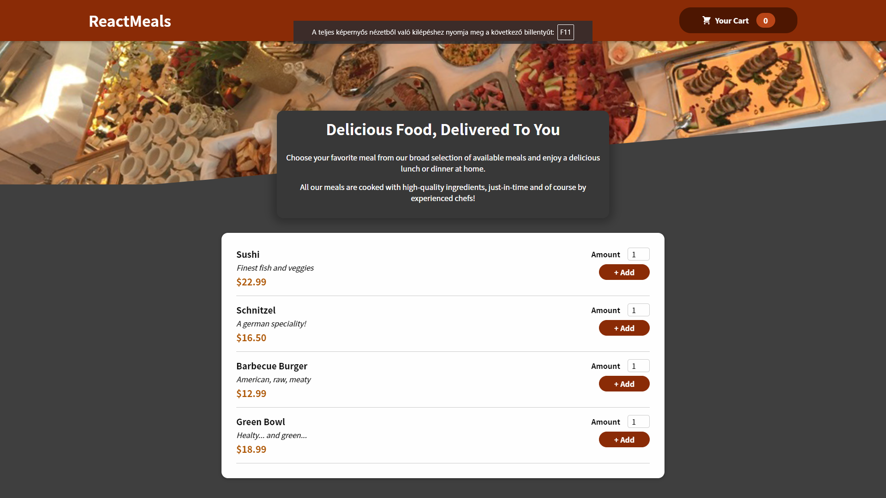

# Food Order App

My objective in building this project was to learn how to send requests to servers and handle the response.

---

---

### [See live version](https://react-http-14562.web.app/)

### Description

Food Order App is a single-page application for ordering meals developed with react. I found this project in an online course, but since I added a quite few
own solutions, (configure inputs, form validation, making responsible, etc...) and I also have a version without the HTTP requests which is 100% my code, I find it ethically acceptable to include
this project in my repo. You can check my base version here: [Base version](/my_base_version)

### Features

- Render a list of meals with the data fetched from the database
- Add selected items and quantities to the cart
- Modify items in the cart and calculate the total amount
- Validate order form field
- Send order data to the server

### What did I learn?

This project helped me improve my skills in multiple areas.

- I got more experience with sending and handling HTTP requests
- Using React.js hooks, but especially the useContext hook
- Creating factory functions and admiring their beauty :) 
- I also learned a little bit about firebase

### Credit

_The project was inspired by [Maximilian](https://academind.com/)_
